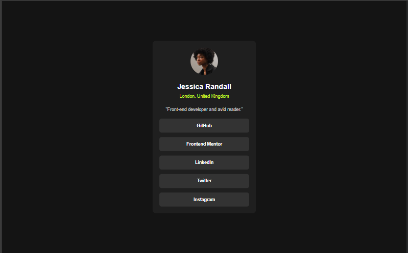
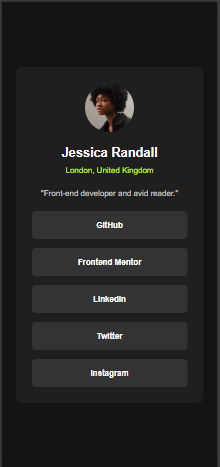

# Frontend Mentor - Social links profile solution

This is a solution to the [Social links profile challenge on Frontend Mentor](https://www.frontendmentor.io/challenges/social-links-profile-UG32l9m6dQ). Frontend Mentor challenges help you improve your coding skills by building realistic projects.

## Table of contents

- [Overview](#overview)
  - [The challenge](#the-challenge)
  - [Screenshot](#screenshot)
  - [Links](#links)
- [My process](#my-process)
  - [Built with](#built-with)
  - [What I learned](#what-i-learned)
  - [Continued development](#continued-development)
  - [Useful resources](#useful-resources)
- [Author](#author)
- [Acknowledgments](#acknowledgments)

### overview

This is a solution to the Social links profile challenge on Frontend Mentor. The goal of this challenge is to build a responsive profile card using HTML and CSS.

### The Challenge

Users should be able to:

- See hover and focus states for all interactive elements on the page

### Screenshot

### Links

- Live Site URL: [Github Pages](https://haese-hks.github.io/social-links-profile/)

- Solution URL: [Frontend Mentor](https://www.frontendmentor.io/solutions/social-links-profile-xFuVLn5v7H)

### My Process

### Built With

- Semantic HTML5 markup
- CSS custom properties
- Flexbox for layout
- Mobile-first responsive design
- Font face

### What I Learned

- Structuring semantic HTML efficiently
- Using Flexbox to align and space items
- Styling interactive buttons and hover states
- Managing spacing with rem and percentages
- Writing clean, reusable CSS with root variables

### Continued Development

Areas I want to keep improving:

- More efficient media query breakpoints
- Better handling of spacing (margin/padding system)
- Improving overall accessibility

### Useful Resources

- [freeCodeCamp](https://www.freecodecamp.org/)

- [MDN Web Docs - CSS](https://developer.mozilla.org/en-US/docs/Web/CSS)

- [W3Schools - CSS](https://www.w3schools.com/css/)

- [Frontend Mentor - Blog Preview Card Challenge](https://www.frontendmentor.io/challenges/blog-preview-card-ryaPa2l8M)

- [Google Fonts](https://fonts.google.com/)

- [CSS-Tricks - Transform](https://css-tricks.com/almanac/properties/t/transform/)

- [GitHub Pages Documentation](https://docs.github.com/en/pages)

### Author

- Frontend Mentor: [@haese-hks](https://www.frontendmentor.io/profile/haese-hks)
- GitHub: [@haese-hks](https://github.com/haese-hks)

### Acknowledgments

- Thanks to [Frontend Mentor](https://www.frontendmentor.io) for providing the challenge and design files.
- Big thanks to the [freeCodeCamp](https://www.freecodecamp.org) community for all the learning resources and tutorials.
- Special thanks to [CSS-Tricks](https://css-tricks.com) for their helpful guides and tutorials on CSS.
- Shout out to the [MDN Web Docs](https://developer.mozilla.org/en-US/docs/Web/CSS) for being an incredible resource for understanding web technologies.
